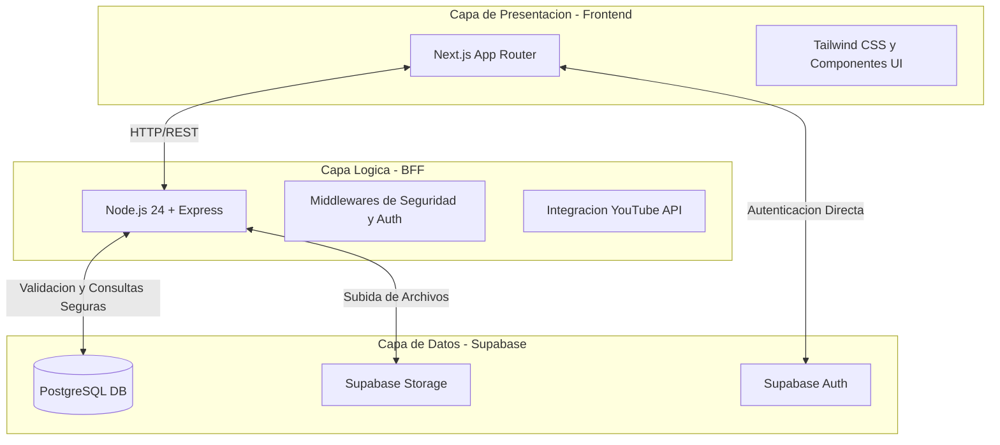
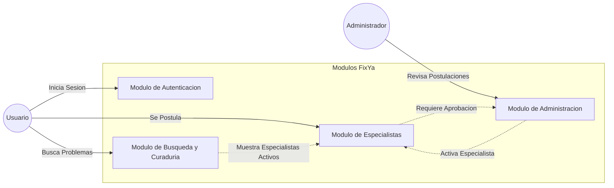
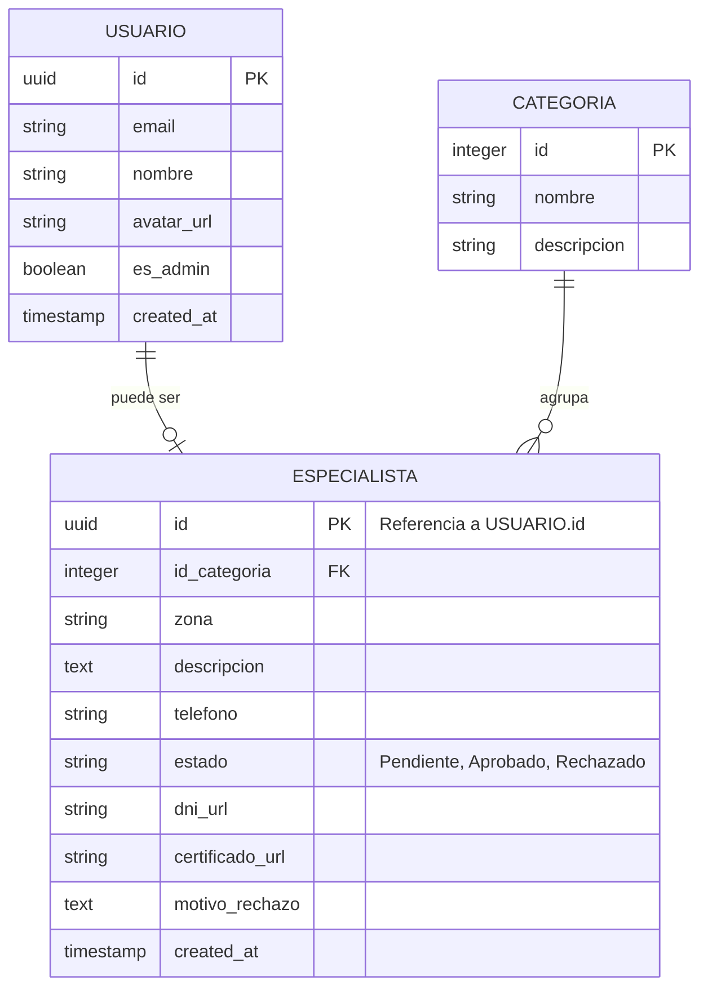
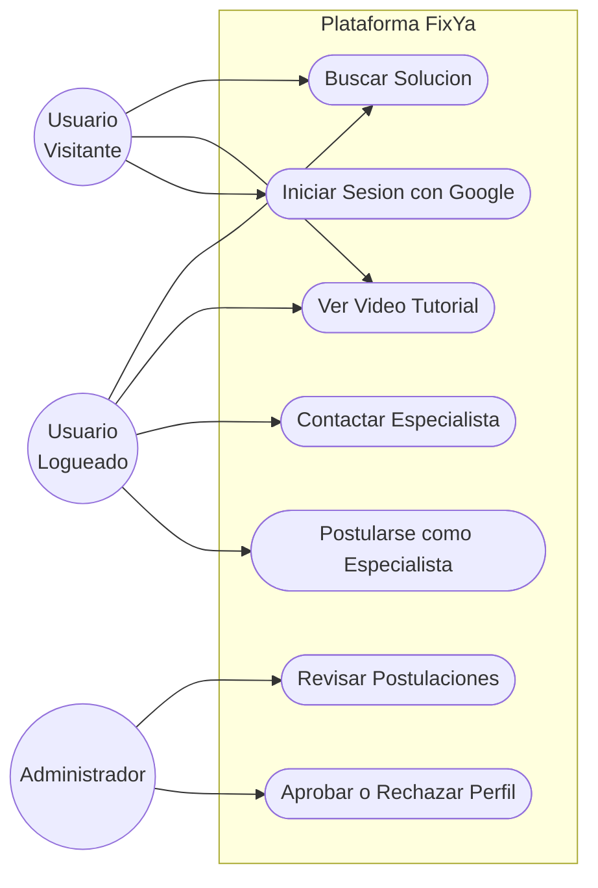
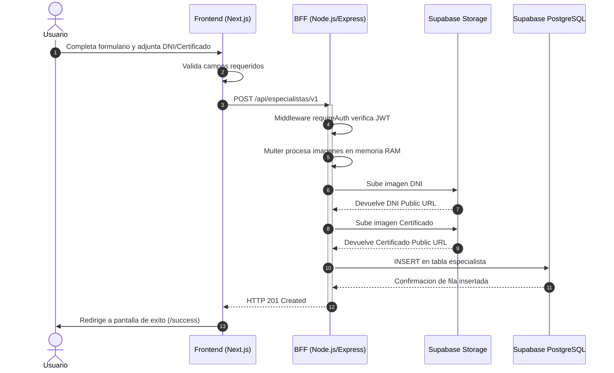

# Arquitectura del Sistema - FixYa

Este documento describe la arquitectura de software, los modulos principales y el modelo de base de datos de la plataforma FixYa.

## 1. Arquitectura de Capas

El sistema esta diseñado utilizando una arquitectura de tres capas principales, separando claramente la interfaz de usuario, la logica de negocio y la persistencia de datos.

### Descripcion de las Capas:
*   **Capa de Presentacion (Frontend):** Desarrollada con Next.js 16. Se encarga de la interfaz, utilizando @supabase/ssr para mantener la sesion del usuario. Se aloja en Vercel.
*   **Capa Logica (BFF):** Un servidor Node.js 24 que actua como intermediario. Protege secretos como la API de YouTube, valida roles (verificacion de Administrador) y procesa subidas de imagenes en memoria usando multer antes de enviarlas a Supabase.
*   **Capa de Datos:** Supabase provee la base de datos PostgreSQL con Row Level Security (RLS) para proteger los registros a nivel de fila, gestion de usuarios con Google OAuth y almacenamiento de documentos.

---

## 2. Diagrama de Modulos

El sistema se divide en cuatro modulos que agrupan las funcionalidades segun el flujo del usuario.

### Detalle de Modulos:
1.  **Modulo de Autenticacion:** Gestiona el inicio y cierre de sesion mediante Google OAuth. Sincroniza automaticamente los datos de Google con la tabla publica de usuarios.
2.  **Modulo de Especialistas:** Permite a los usuarios postularse como profesionales. Carga datos de contacto, rubro y archivos respaldatorios como DNI y certificados.
3.  **Modulo de Busqueda y Curaduria (Sprint 3):** Permite al usuario buscar soluciones, interactua con la API de YouTube para obtener tutoriales y sugiere a los especialistas aprobados de la zona.
4.  **Modulo de Administracion:** Panel privado para moderadores. Permite visualizar las postulaciones pendientes, revisar los documentos adjuntos y aprobar o rechazar a los profesionales.

---

## 3. Modelo de Base de Datos (ERD)

El esquema relacional garantiza la integridad referencial y permite la consulta de los especialistas aprobados por categoria.

### Reglas de Negocio (RLS - Row Level Security):
*   **Privacidad:** Un USUARIO solo puede modificar su propio registro de ESPECIALISTA.
*   **Visibilidad:** El publico general solo puede leer registros de ESPECIALISTA cuyo estado sea Aprobado.
*   **Administracion:** Solo los usuarios con es_admin = true pueden hacer operaciones de UPDATE sobre el campo estado o motivo_rechazo.

---

## 4. Diagrama de Casos de Uso

Este diagrama define de forma funcional las acciones que cada tipo de actor puede realizar dentro del sistema.

Nota: Un Usuario Logueado hereda la capacidad de interactuar con el sistema mas a fondo que un visitante, incluyendo la postulacion y el contacto por WhatsApp.

---

## 5. Diagrama de Secuencia: Postulacion de Especialista

El siguiente diagrama ilustra el proceso donde un usuario sube su documentacion para ser especialista.

### Justificacion Tecnica del Flujo:
1. **Seguridad JWT:** El Frontend envia el token de sesion emitido por Supabase al BFF. El BFF valida criptograficamente el token antes de procesar archivos.
2. **Optimizacion de Recursos:** El BFF nunca guarda los archivos fisicos de los usuarios en su propio disco duro. Los retiene en memoria RAM y los transfiere directamente a Supabase Storage. Esto garantiza que el servidor Node.js no se quede sin espacio.
