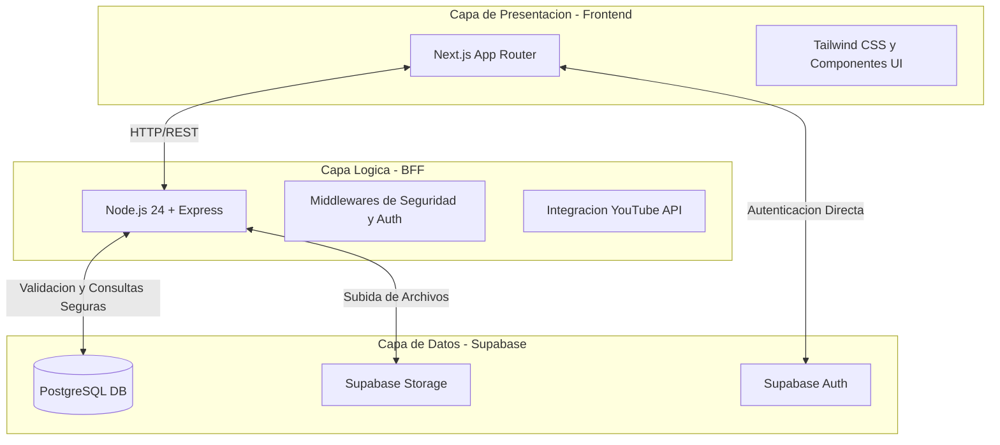
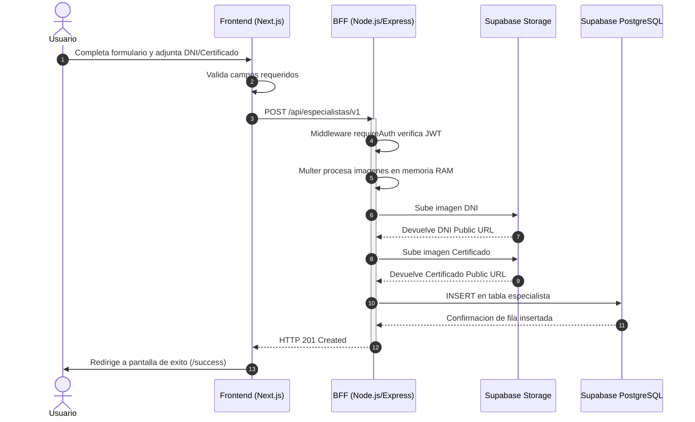

# Arquitectura del Sistema - FixYa

Este documento describe la arquitectura de software, los modulos principales y el modelo de base de datos de la plataforma FixYa.

## 1. Arquitectura de Capas

El sistema esta diseñado utilizando una arquitectura de tres capas principales, separando claramente la interfaz de usuario, la logica de negocio y la persistencia de datos.

### Descripcion de las Capas:
*   **Capa de Presentacion (Frontend):** Desarrollada con Next.js 16. Se encarga de la interfaz, utilizando @supabase/ssr para mantener la sesion del usuario. Se aloja en Vercel.
*   **Capa Logica (BFF):** Un servidor Node.js 24 que actua como intermediario. Protege secretos como la API de YouTube, valida roles (verificacion de Administrador) y procesa subidas de imagenes en memoria usando multer antes de enviarlas a Supabase.
*   **Capa de Datos:** Supabase provee la base de datos PostgreSQL con Row Level Security (RLS) para proteger los registros a nivel de fila, gestion de usuarios con Google OAuth y almacenamiento de documentos.

---

## 2. Diagrama de Casos de Uso

Este diagrama define de forma funcional las acciones que cada tipo de actor puede realizar dentro del sistema.

Nota: Un Usuario Logueado hereda la capacidad de interactuar con el sistema mas a fondo que un visitante, incluyendo la postulacion y el contacto por WhatsApp.

---

## 3. Diagrama de Secuencia: Postulacion de Especialista

El siguiente diagrama ilustra el proceso donde un usuario sube su documentacion para ser especialista.

### Justificacion Tecnica del Flujo:
1. **Seguridad JWT:** El Frontend envia el token de sesion emitido por Supabase al BFF. El BFF valida criptograficamente el token antes de procesar archivos.
2. **Optimizacion de Recursos:** El BFF nunca guarda los archivos fisicos de los usuarios en su propio disco duro. Los retiene en memoria RAM y los transfiere directamente a Supabase Storage. Esto garantiza que el servidor Node.js no se quede sin espacio.

---

## 4. Infraestructura y Despliegue

Todo proyecto de software profesional requiere una estrategia solida de despliegue y control de versiones. Para este trabajo practico, se implemento lo siguiente:

*   **Control de Versiones:** El codigo fuente se gestiona integramente en GitHub. Esto permite llevar un historial de cambios atomicos (commits) y facilita la integracion continua (CI/CD).
*   **Despliegue del Frontend:** La aplicacion Next.js esta vinculada directamente a Vercel. Cada vez que se sube codigo a la rama principal de GitHub, Vercel compila y despliega la aplicacion automaticamente en una red global (CDN).
*   **Despliegue del Backend (BFF):** El servidor Node.js se aloja en un Servidor Privado Virtual (VPS) propio. Para exponer este servidor a internet de forma segura sin abrir puertos en el firewall, se utilizan **Tuneles de Cloudflare (Cloudflare Tunnels)**. Esto garantiza conexion cifrada de extremo a extremo y proteccion contra ataques DDoS.
*   **Gestion de Secretos:** Ninguna clave de API (Supabase, YouTube) esta hardcodeada en el codigo. Se utilizan variables de entorno (`.env.local`) tanto en desarrollo como en los servidores de produccion para garantizar la maxima seguridad.
