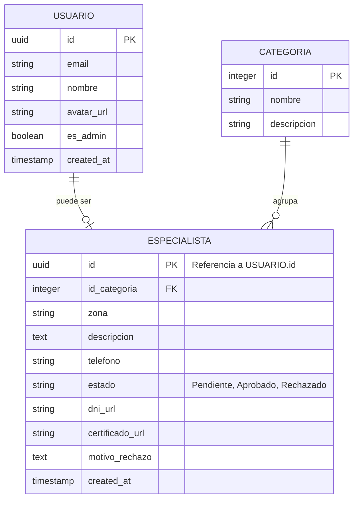

# Diseño de Base de Datos - FixYa

El esquema relacional garantiza la integridad referencial y permite la consulta de los especialistas aprobados por categoria.

## Reglas de Negocio (RLS - Row Level Security):
*   **Privacidad:** Un USUARIO solo puede modificar su propio registro de ESPECIALISTA.
*   **Visibilidad:** El publico general solo puede leer registros de ESPECIALISTA cuyo estado sea Aprobado.
*   **Administracion:** Solo los usuarios con es_admin = true pueden hacer operaciones de UPDATE sobre el campo estado o motivo_rechazo.
