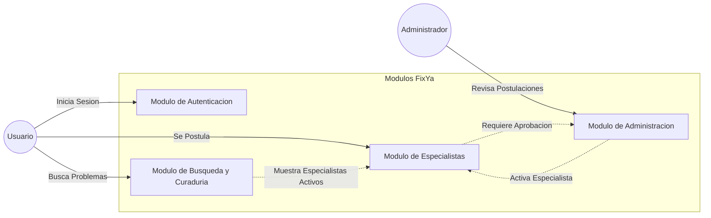

# Listado de Módulos - FixYa

El sistema se divide en cuatro módulos que agrupan las funcionalidades según el flujo del usuario.

## Detalle y Descripción de Módulos:
1.  **Modulo de Autenticacion:** Gestiona el inicio y cierre de sesion mediante Google OAuth. Sincroniza automaticamente los datos de Google con la tabla publica de usuarios.
2.  **Modulo de Especialistas:** Permite a los usuarios postularse como profesionales. Carga datos de contacto, rubro y archivos respaldatorios como DNI y certificados.
3.  **Modulo de Busqueda y Curaduria (Sprint 3):** Permite al usuario buscar soluciones, interactua con la API de YouTube para obtener tutoriales y sugiere a los especialistas aprobados de la zona.
4.  **Modulo de Administracion:** Panel privado para moderadores. Permite visualizar las postulaciones pendientes, revisar los documentos adjuntos y aprobar o rechazar a los profesionales.
